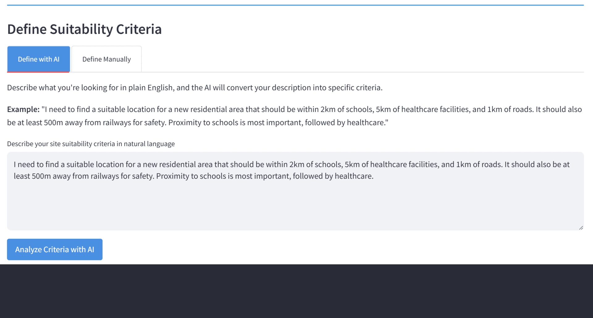

# LLM-Driven Spatial Decision Support System

An advanced geospatial decision support system that combines **Large Language Models (LLMs)**, **Geographic Information Systems (GIS)**, and **Multi-Criteria Decision Analysis (MCDA)** to identify optimal locations for development projects.



## Overview

This application helps urban planners, real estate developers, and policy makers identify suitable land parcels by analyzing multiple spatial criteria. What makes it unique is the integration of natural language processing - describe your requirements in plain English, and the system converts them into sophisticated GIS analysis.

## Key Features

### Natural Language Criteria Definition
Instead of manually configuring GIS parameters, you can describe your requirements naturally:
- "Find locations within 2km of schools, near healthcare facilities, but away from railways"
- The AI interprets your request and extracts relevant GIS layers, distance requirements, and weights

### Multi-Criteria Spatial Analysis
- Weighted overlay analysis combining multiple spatial factors
- Distance calculations from various features (schools, hospitals, roads, etc.)
- Raster-based suitability modeling
- Automatic extraction of top candidate locations

### AI-Powered Insights
- Location recommendations with detailed justifications
- Comparative analysis of top candidates
- Expert insights combining GIS analysis with urban planning knowledge
- Interactive chatbot for asking questions about your results

### Comprehensive Reporting
- Interactive maps with location markers
- PDF reports with maps, location details, and analysis summaries
- CSV exports of location data
- Visualizations of individual layer contributions

## Technology Stack

- **Frontend**: Streamlit for interactive web interface
- **GIS Processing**: GeoPandas, Rasterio, PyLUSAT
- **AI/LLM**: Google Gemini API for natural language understanding and analysis
- **Database**: PostgreSQL with PostGIS extension
- **Visualization**: Matplotlib, Folium, PyDeck
- **Spatial Analysis**: Custom MCDA algorithms with weighted overlay

## Installation

### Prerequisites

- Python 3.10 or higher
- PostgreSQL with PostGIS extension
- GDAL library (installation varies by OS)
- Google Gemini API key (get one at [Google AI Studio](https://makersuite.google.com/app/apikey))

### Setup Steps

1. Clone this repository:
```bash
git clone https://github.com/CONFUZ3/llm-sdss
cd llm-sdss
```

2. Create a virtual environment:
```bash
python -m venv venv
source venv/bin/activate  # On Windows: venv\Scripts\activate
```

3. Install dependencies:
```bash
pip install -r requirements.txt
```

Note: GDAL installation can be tricky. On Windows, consider using conda:
```bash
conda install -c conda-forge gdal
```

4. Set up your PostgreSQL database:
- Install PostgreSQL with PostGIS extension
- Create a database and load your spatial layers
- Ensure tables have a geometry column named 'geom'

5. Run the application:
```bash
streamlit run app.py
```

## Usage

### Database Connection

1. Start the application and navigate to the sidebar
2. Enter your PostgreSQL connection details:
   - Host, port, database name
   - Username and password
3. Click "Connect" to establish the connection

### Gemini API Configuration

For AI-powered features:
1. Get a Gemini API key from Google AI Studio
2. Enter it in the sidebar under "Gemini API Configuration"
3. Click "Connect" to activate AI features

### Running an Analysis

#### Option 1: AI-Powered Criteria Definition

1. Go to the "Analysis" tab
2. Select "Define with AI"
3. Describe your requirements in natural language, for example:
   > "I need locations for a residential development that are within 2km of schools, within 5km of healthcare facilities, close to roads (within 1km), and at least 500m away from railways for safety. Proximity to schools is most important."

4. Click "Analyze Criteria with AI"
5. Review the extracted criteria
6. Click "Run Suitability Analysis"

#### Option 2: Manual Criteria Definition

1. Select "Define Manually" tab
2. Choose layers from your database
3. Set distance requirements and weights for each layer
4. Specify which layers to avoid (e.g., railways)
5. Click "Set Manual Criteria"
6. Click "Run Suitability Analysis"

### Viewing Results

The Results tab provides:
- **Suitability Map**: Visual representation of suitability scores
- **Location Table**: Detailed information about suitable locations
- **Interactive Map**: Explore locations with markers and popups
- **AI Analysis**: Expert insights and recommendations
- **PDF Report**: Generate comprehensive analysis reports
- **Expert Chatbot**: Ask questions about your analysis

## Project Structure

```
.
├── app.py                      # Main Streamlit application entry point
├── config.py                   # Configuration constants and CSS styling
├── models.py                   # Data models (DatabaseConfig, AnalysisCriteria, etc.)
├── database.py                 # PostgreSQL database service
├── llm_service.py             # Google Gemini API integration
├── geocoding.py               # Reverse geocoding service
├── spatial_analysis.py         # GIS spatial analysis operations
├── visualization.py           # Map and chart generation
├── pdf_report.py              # PDF report generation
├── suitability_analysis.py    # Main MCDA analysis logic
├── ui_components.py           # Streamlit UI components
├── requirements.txt           # Python dependencies
├── .gitignore                 # Git ignore file
└── README.md                  # This file
```

## Understanding the Analysis Process

1. **Criteria Extraction**: AI converts natural language into structured GIS criteria
2. **Layer Loading**: Spatial data loaded from PostgreSQL database
3. **Grid Creation**: Analysis grid created in appropriate UTM projection
4. **Distance Calculation**: Euclidean distance calculated from each feature layer
5. **Reclassification**: Distances converted to suitability scores (0-100)
6. **Weighted Overlay**: Multiple layers combined using specified weights
7. **Location Extraction**: Top suitable locations identified and clustered
8. **Geocoding**: Address information retrieved for locations
9. **AI Analysis**: Expert insights generated using Gemini API
10. **Visualization**: Maps and reports generated

## Available GIS Layers

The system works with any spatial layers in your PostgreSQL database. Common examples include:
- Schools, healthcare facilities, banks
- Transportation: roads, railways, bus stops
- Land use: built-up areas, water bodies, bare land, crops
- Infrastructure: utilities, parks, religious sites

## Customization

### Adding New Layers

Simply add new tables to your PostgreSQL database with PostGIS geometry columns. The application will automatically detect them.

### Modifying Analysis Logic

Edit `suitability_analysis.py` to change:
- Weight calculation methods
- Location extraction thresholds
- Raster processing approaches

### Customizing Prompts

Modify prompts in `llm_service.py` to change how the AI interprets criteria or generates insights.

## Limitations and Considerations

- **Database Required**: You need a PostgreSQL database with PostGIS and your spatial data pre-loaded
- **API Costs**: Gemini API usage may incur costs (check Google's pricing)
- **Processing Time**: Large datasets or fine cell sizes increase computation time
- **Projection**: Analysis automatically selects UTM zone, but ensure your data has proper CRS information

## Troubleshooting

### Database Connection Issues
- Verify PostgreSQL is running
- Check PostGIS extension is installed: `CREATE EXTENSION postgis;`
- Ensure geometry column is named 'geom'
- Check firewall settings for remote connections

### GDAL Errors
- Install GDAL through conda or system package manager
- On Windows, use conda: `conda install -c conda-forge gdal`
- Verify installation: `python -c "import osgeo; print(osgeo.__version__)"`

### Gemini API Errors
- Verify API key is correct
- Check API quota/usage limits
- Some features work without API key (manual criteria definition)

## License

Copyright (c) [2025] [Mahad Imran]. All Rights Reserved.

This software is provided for use only. You are permitted to:
- Use the code for personal or academic purposes
- Modify the code for your own use
- Study how the code works

You are NOT permitted to:
- Publish, distribute, or redistribute this code in any form
- Submit contributions or modifications back to this repository
- Share or redistribute any part of this codebase

THE SOFTWARE IS PROVIDED "AS IS", WITHOUT WARRANTY OF ANY KIND, EXPRESS OR IMPLIED, INCLUDING BUT NOT LIMITED TO THE WARRANTIES OF MERCHANTABILITY, FITNESS FOR A PARTICULAR PURPOSE AND NONINFRINGEMENT. IN NO EVENT SHALL THE AUTHORS OR COPYRIGHT HOLDERS BE LIABLE FOR ANY CLAIM, DAMAGES OR OTHER LIABILITY, WHETHER IN AN ACTION OF CONTRACT, TORT OR OTHERWISE, ARISING FROM, OUT OF OR IN CONNECTION WITH THE SOFTWARE OR THE USE OR OTHER DEALINGS IN THE SOFTWARE.

## Acknowledgments

Built using:
- Streamlit for the web framework
- GeoPandas and Rasterio for spatial processing
- Google Gemini for AI capabilities
- PyLUSAT for distance calculations
- Folium and Matplotlib for visualization

## Contact
You can reach me at mahad.imran29@gmail.com

